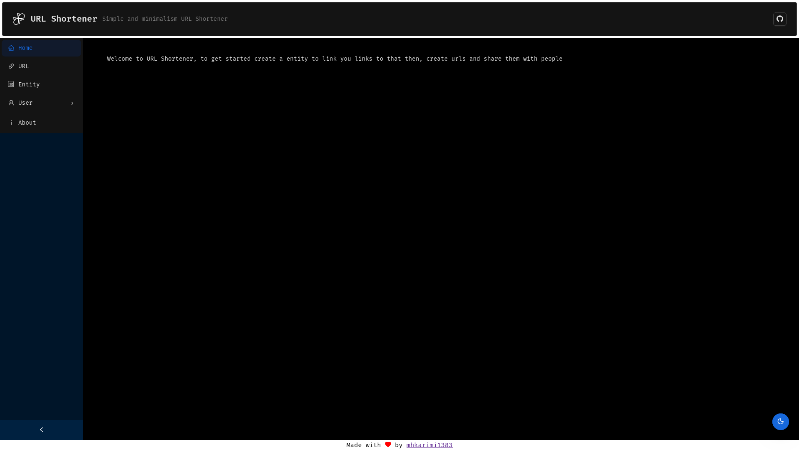
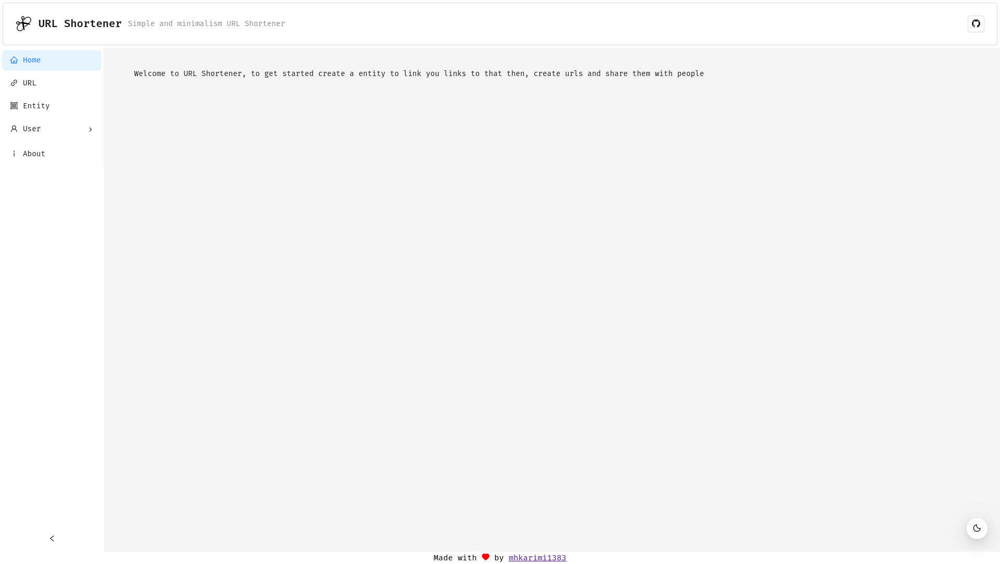
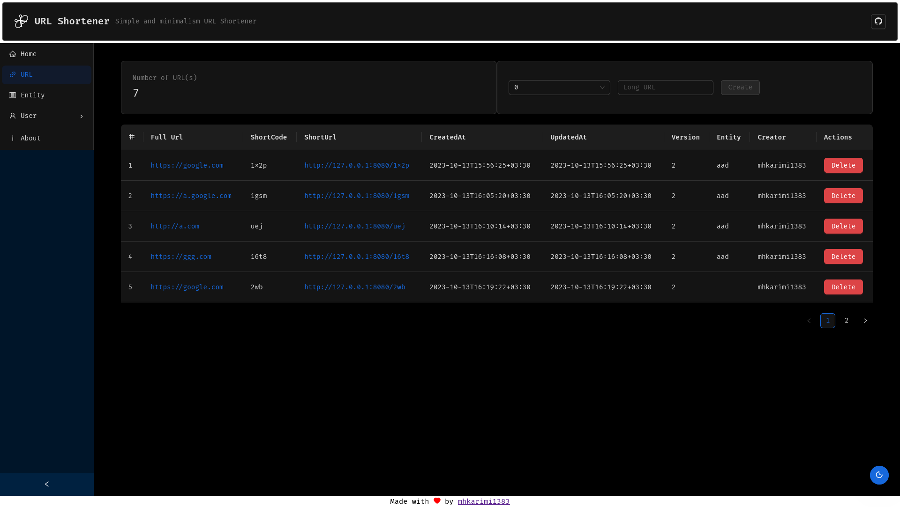
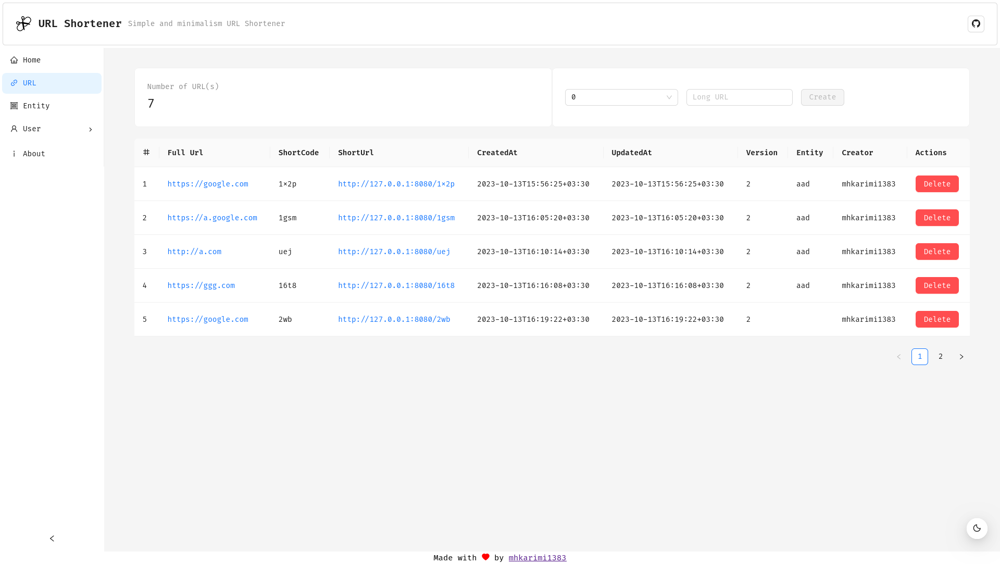
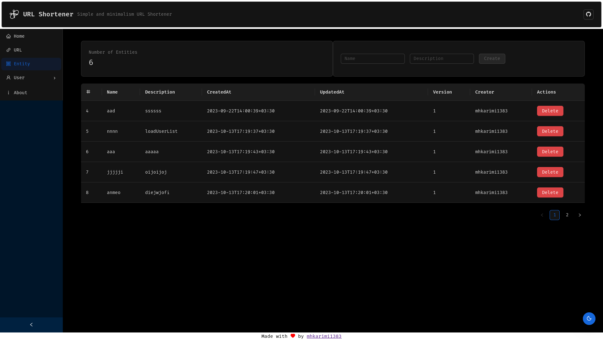
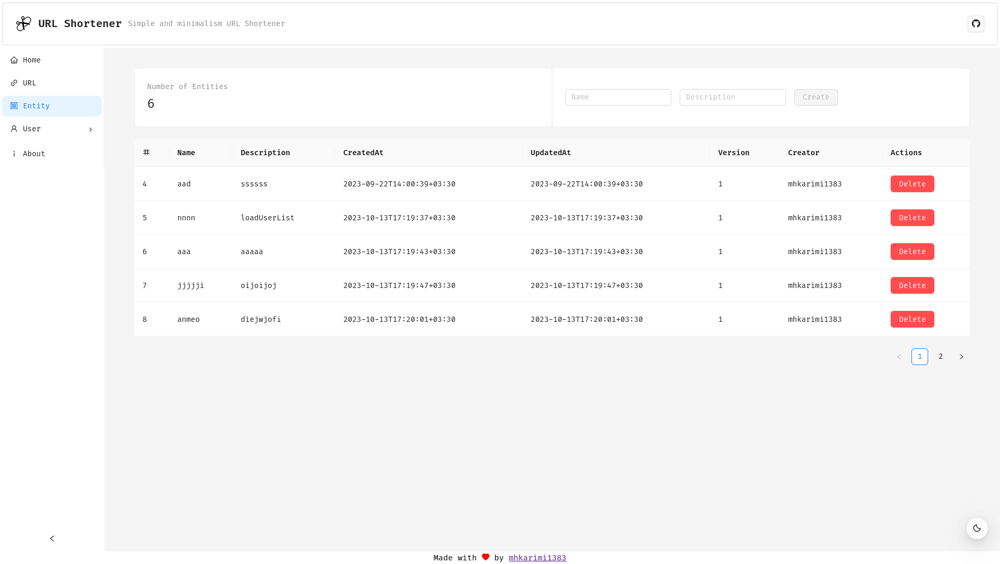

# URL Shortener

Simple and minimalism URL Shortener

## Made out of

- Golang for backend
- XORM as ORM
- Echo as HTTP Framework
- go-playground/validator as Validator
- Cobra as cli and configuration manager
- TS for frontend
- Vue3 as Frontend framework
- Ant Design Vue as UI Components
- ...

## Screenshots

</img> </img> </img> </img> </img> </img>

## Running project

just run project with `--help` to see options and their env equivalent

### Configuration params

- FLAG: `--add-referer-query-param`  
  ENV: `USH_ADD_REFERER_QUERY_PARAM`  
  Default: true  
  Description: Add `referer` query param to redirect url or not

- FLAG: `--database-connection-string`  
  ENV: `USH_DATABASE_CONNECTION_STRING`  
  Default: "./database.sqlite3"  
  Description: Connection string of database, use `postgres://127.0.0.1:5432/url_shortener` for `postgres` and `root:@tcp(127.0.0.1:3306)/url_shortener?charset=utf8` for `mysql`

- FLAG: `--database-engine`  
  ENV: `USH_DATABASE_ENGINE`  
  Default: "sqlite"  
  Description: The engine of database, use `pgx` for `postgres`, `mysql` for `mysql` and `sqlite` for `sqlite`

- FLAG: `--database-max-connection-lifetime`  
  ENV: `USH_DATABASE_MAX_CONNECTION_LIFETIME`  
  Default: "5m0s"  
  Description: Maximum lifetime for database connections in second used by connection pool

- FLAG: `--database-max-idle-connections`  
  ENV: `USH_DATABASE_MAX_IDLE_CONNECTIONS`  
  Default: 4  
  Description: Number of maximum idle connections to database used by connection pool

- FLAG: `--database-max-open-connections`  
  ENV: `USH_DATABASE_MAX_OPEN_CONNECTIONS`  
  Default: 10  
  Description: Number of maximum open connections to database used by connection pool

- FLAG: `--jwt-secret`  
  ENV: `USH_JWT_SECRET`  
  Default: "superdupersecret"  
  Description: jwt secret to sign tokens with, strongly recommended to change

- FLAG: `--listen-address`/`-l`  
  ENV: `USH_LISTEN_ADDRESS`  
  Default: "127.0.0.1:8080"  
  Description: Host:Port to listen

- FLAG: `--migrate`/`-m`  
  ENV: `USH_MIGRATE`  
  Default: true  
  Description: To run migrations or not

- FLAG: `--random-generator-max`  
  ENV: `USH_RANDOM_GENERATOR_MAX`  
  Default: 10000  
  Description: Generator will use this to generate shortcodes (higher value = bigger shortcodes), at least 10000 should be set

- FLAG: `--root-redirect`/`-r`  
  ENV: `USH_ROOT_REDIRECT`  
  Default: "/ui/"  
  Description: Path/URL to redirect when someone comes to root url

- FLAG: `--run-server`/`-s`  
  ENV: `USH_RUN_SERVER`  
  Default: true  
  Description: To run webserver or not

- FLAG: `--base-uri`  
  ENV: `USH_BASE_URI`  
  Default: "/"  
  Description: Base URI of project

### Running Locally (for development)

**Unix Users Only** use run script, it will install dependencies, format the code and run the project

### Docker (for production)

Available as `ghcr.io/mhkarimi1383/url-shortener:main`

sample `docker-compose` in available as [docker-compose.yaml](docker-compose.yaml)

simply run that with the options/envs as you want

## TODO

- [x] Add more deploy/build options
- [ ] API Documentation (swaggo is buggy and generating errors with some datatypes)
- [x] Vue3 Frontend
- [ ] Webhook Support
- [x] Basic Visit stat repoting
